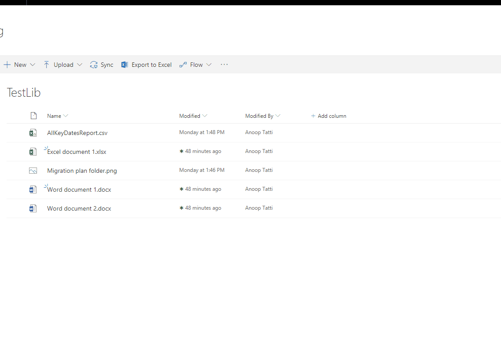

## SPFx command extension to convert documents to PDF using Azure function

Sample SPFx list view command set extension that converts the selected documents to PDF using Microsoft Graph.
> Inspired from the [YouTube Video](https://www.youtube.com/watch?v=syEYHYYUps8) by Paolo Pialorsi ([@PaoloPia](https://twitter.com/PaoloPia)) and from the [answer in Stack Overflow](https://stackoverflow.com/questions/51493302/whats-the-easiest-way-to-fetch-a-sharepoint-file-by-a-path-from-the-microsoft-g) by Vadim Gremyachev ([@vgrem](https://twitter.com/vgrem))



This project contains two separate project folders:

* [ConvertToPDFRequest](./ConvertToPDFRequest) - contain the Azure Function written in C#
* [ConvertToPDFExtension](./ConvertToPDFExtension) - contains the SPFx extension consuming the local running Azure Function

## Used SharePoint Framework Version


## Applies to

* [SharePoint Framework Extensions](https://docs.microsoft.com/en-us/sharepoint/dev/spfx/extensions/overview-extensions)

## Solution

Solution|Author(s)
--------|---------
js-command-convert-to-pdf | Anoop T ([@anooptells](https://twitter.com/anooptells))

## Version history

Version|Date|Comments
-------|----|--------
1.0|October 29, 2018|Initial release

## Disclaimer
**THIS CODE IS PROVIDED *AS IS* WITHOUT WARRANTY OF ANY KIND, EITHER EXPRESS OR IMPLIED, INCLUDING ANY IMPLIED WARRANTIES OF FITNESS FOR A PARTICULAR PURPOSE, MERCHANTABILITY, OR NON-INFRINGEMENT.**

## Features
This extension illustrates the following concepts:
* Using [Microsoft Graph Convert Content](https://developer.microsoft.com/en-us/graph/docs/api-reference/v1.0/api/driveitem_get_content_format) to convert document to PDF
* Uses [Sweetalert2](https://sweetalert2.github.io/) for displaying alerts

## Build Azure Function

To install and run the Azure Function navigate to the folder: [ConvertToPDFRequest](./ConvertToPDFRequest) in Visual studio and build it.

This will install all the required nuget packages to run the Azure function

### Additional Configuration

* Create an application registration in Azure AD and provide **Read files in all site collections** application permission under the Microsoft Graph API.
* Grant admin consent.
* Create a secret for it and save it somewhere safe. Also copy the application id.
* Navigate to https://yoursitecollectiion/_layouts/15/appinv.aspx
* Search for the application created earlier with it's id
* Add the following in the permissions XML box
```xml
<AppPermissionRequests AllowAppOnlyPolicy="true">
  <AppPermissionRequest Scope="http://sharepoint/content/sitecollection/web/list" Right="FullControl"/>
</AppPermissionRequests>
```
* Select the library where the documents are stored.

### Additional Configuration for the Azure Function

Navigate to the local.settings.json file and add the following

```jS
{
    "IsEncrypted": false,
  "Values": {
    "AzureWebJobsStorage": "UseDevelopmentStorage=true",
    "AzureWebJobsDashboard": "UseDevelopmentStorage=true",
    "TenantId": "ENTER THE TENANT ID (can be found in Azure AD properties)",
    "ClientId": "ENTER THE APPLICATION ID COPIED EARLIER",
    "ClientSecret": "ENTER THE APPLICATION SECRET COPIED EARLIER",
    "RedirectUri": "https://login.microsoftonline.com"
  },
  "Host": {
    "CORS": "*"
  }
}
```
#### Run Azure Function

Open the Azure function project [ConvertToPDFRequest](./ConvertToPDFRequest) in Visual Studio and press F5.

### Run the SPFx webpart Web Part

- Clone this repository
- Update the `pageUrl` properties in the **config/serve.json** file
  - The `pageUrl` should be a modern page
  - This property is only used during development in conjunction with the `gulp serve` command
- In the command line navigate to the [ConvertToPDFExtension](./ConvertToPDFExtension) folder and run:
  - `npm install`
  - `gulp serve --config=convertToPdf`

## Debug URL for testing
Here's a debug querystring for testing this sample:

```
?loadSPFX=true&debugManifestsFile=https://localhost:4321/temp/manifests.js&customActions={"5aacbfec-2af5-4f4c-9e14-f0d8e11fd2de":{"location":"ClientSideExtension.ApplicationCustomizer","properties":{"confirmButtonColor":"#000000"}}}
```

Your URL will look similar to the following (replace with your domain and site address):
```
https://yourtenant.sharepoint.com/sites/yoursite?loadSPFX=true&debugManifestsFile=https://localhost:4321/temp/manifests.js&customActions={"5aacbfec-2af5-4f4c-9e14-f0d8e11fd2de":{"location":"ClientSideExtension.ApplicationCustomizer","properties":{"confirmButtonColor":"#000000"}}}
  
